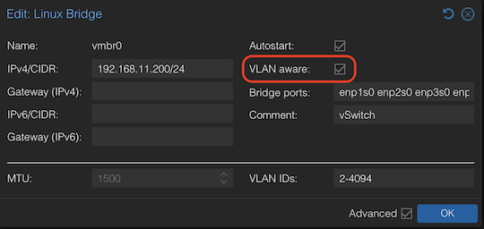
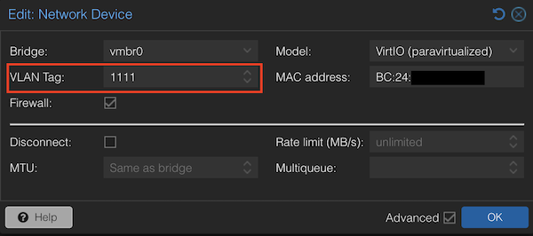

# CF WARP Router

A tiny Proxmox LXC container that puts every VM and LXC you choose behind a Cloudflare WARP tunnel.<br>
Tag a NIC with VLAN `1111`, and that guest is on a premium route, with ad blocking, encrypted DNS and a kill switch. No client software, no config file on the guest.

<p>
<a href="https://github.com/LongQT-sea/cf-warp-router/actions/workflows/build.yml"></a>
<a href="https://github.com/LongQT-sea/cf-warp-router/pkgs/container/cf-warp-router"></a>
<a href="https://hub.docker.com/r/long025733/cf-warp-router"></a>
<a href="https://hub.docker.com/r/long025733/cf-warp-router"></a>


</p>

**See [Quick start](#quick-start)** to set this up in under 5 minutes.

---

## Why you want this

Your ISP peers badly. Downloads from GitHub, SourceForge, Docker Hub or any overseas mirror crawl at a few hundred KB/s, and `git clone` or `apt/dnf upgrade` takes hours. The bandwidth you pay for is fine, the *route* is not.

This container terminates a Cloudflare WARP tunnel and hands it out as a gateway to your guests. Traffic leaves your ISP at the nearest Cloudflare edge and rides their backbone from there, which usually turns those KB/s into MB/s. Free WARP account, no signup, registered automatically on first boot.

Set it up once on the hypervisor. Every guest that wants the good route just gets a VLAN tag.

## What it does

- **Zero config for clients.** DHCP, DHCPv6, SLAAC and DNS are served by the router. Tag the NIC, boot the guest, done.
- **Real kill switch.** `nftables` forward policy is `drop`. If the tunnel goes down, guest traffic stops instead of silently leaking out over your ISP route.
- **Ad blocking out of the box.** AdGuard Home is preinstalled and pre-wired to DNS over HTTPS upstreams (Cloudflare, Google, Quad9) with HTTP/3 and optimistic caching.
- **DNS hijack.** Guests hardcoded to `8.8.8.8` or `1.1.1.1` get transparently redirected to the router, so nothing escapes the filter.
- **IPv6 that works.** WARP only gives you a single `/128`, so the router does NAT66 and hands your guests a proper `fdfd:1111::/64` with RA and MTU advertisement.
- **A second, offline VLAN.** VLAN `2222` is a private lab LAN: DHCP and DNS, but no default route.
- **Small and boring.** Debian 13 slim, a stub package that skips roughly 600 MB of WARP GUI dependencies, `warp-svc` memory capped at 400 MB. Runs happily in 512 MB RAM and a 4 GB disk.
- **Rebuilt monthly** for amd64 and arm64, published to GHCR and Docker Hub.

## Topology

```text
        your normal LAN / ISP router
                    │
                  eth0   DHCP uplink (optionally VLAN tagged)
        ┌───────────┴────────────┐
        │     cf-warp-router     │   warp-svc  ·  nftables  ·  dnsmasq  ·  AdGuard Home
        └───────────┬────────────┘
                  eth1   br0, VLAN aware
            ┌───────┴────────┐
       VLAN 1111         VLAN 2222
     10.11.11.0/24     10.22.22.0/24
     fdfd:1111::/64    (no gateway)
   internet via WARP    LAN only, air gapped
```

| | VLAN 1111 (`warp.lan`) | VLAN 2222 (`lab.lan`) |
|---|---|---|
| Gateway | `10.11.11.1`, `fdfd:1111::` | none, on purpose |
| DHCP pool | `.100` to `.199` | `.100` to `.199` |
| DNS | `10.11.11.1` | `10.22.22.1` |
| Internet | through the WARP tunnel | no |

## Requirements

- Proxmox VE 9 with a **VLAN aware** bridge (default `vmbr0`).
- 4 GB of storage, 512 MB RAM, 2 cores.

> [!IMPORTANT]
> Your bridge must have **VLAN aware** ticked, otherwise tagged guests will not reach the router.
>
> 

## Quick start

Run these on the **Proxmox host shell**.

**1. Pull the image**

```sh
skopeo copy docker://ghcr.io/longqt-sea/cf-warp-router:latest \
  oci-archive:/var/lib/vz/template/cache/cf-warp-router_latest.tar
```

**2. Create the container**

```sh
# Configure, or just leave everything blank for the defaults
BRIDGE=             # Default: vmbr0
VLAN_ID=            # Uplink VLAN tag, leave empty if unsure
STORAGE=            # Default: local-lvm
VMID=               # Default: 1111
ROOT_PASSWORD=''    # Default: 123456
NAME=''             # Default: warp-router
DISK_SIZE_GB=       # Default: 4
CPU_CORE=           # Default: 2
RAM_MB=             # Default: 512

pct create "${VMID:=1111}" local:vztmpl/cf-warp-router_latest.tar \
  --arch $(dpkg --print-architecture) --ostype debian \
  --hostname "${NAME:-warp-router}" \
  --password "${ROOT_PASSWORD:-123456}" \
  --cores "${CPU_CORE:-2}" --memory "${RAM_MB:-512}" \
  --rootfs "${STORAGE:-local-lvm}:${DISK_SIZE_GB:-4}" \
  --unprivileged 1 \
  --features nesting=1 \
  --dev0 /dev/net/tun \
  --net0 name=eth0,bridge="${BRIDGE:=vmbr0}",firewall=0,host-managed=0,"${VLAN_ID:+tag=$VLAN_ID,}"ip=dhcp,ip6=dhcp,type=veth \
  --net1 name=eth1,bridge="$BRIDGE",firewall=0,host-managed=0,type=veth \
  -onboot 1

pct start $VMID
```

`eth0` is the uplink to your normal LAN. `eth1` is the trunk port that carries VLAN 1111 and 2222 to your guests. Both sit on the same VLAN aware bridge, no extra host bridge needed.

**3. Point a guest at it**

- Put the guest NIC on the same VLAN aware bridge (default `vmbr0`).
- Set **VLAN Tag** to `1111`.
- Reboot the guest, or just renew its lease.



That is the whole setup. Verify from inside the guest:

```sh
curl -sS https://www.cloudflare.com/cdn-cgi/trace | grep warp=    # expect warp=on, or warp=plus with a key
```

> [!NOTE]
> The client VLAN `1111` is fixed and has nothing to do with `$VLAN_ID` above, which only tags the router's own uplink.

---

## Day to day

Everything below runs inside the container, via `pct enter <VMID>` or SSH as root.

```sh
warp-cli status                 # tunnel state
warp-cli registration           # registration and plan
systemctl status warp-svc dnsmasq AdGuardHome
```

**Got a WARP+ key?** Paste it in and reconnect:

```sh
warp-cli registration license <YOUR_KEY>
warp-cli connect
```

**AdGuard Home** web UI: `http://10.11.11.1:3000` from any VLAN 1111 guest.

**Static leases, extra domains, different pools:** edit `/etc/dnsmasq.d/dhcp.conf` and `systemctl restart dnsmasq`.

**Firewall tweaks:** `/etc/nftables.d/50-router.nft`, then `systemctl restart nftables`.

**Subnets and VLAN IDs:** `/etc/network/interfaces`.

## Troubleshooting

| Symptom | Check |
|---|---|
| Guest gets no IP | Bridge is **VLAN aware**, guest NIC tag is `1111`, router `eth1` is on the same bridge |
| IP but no internet | `warp-cli status` inside the router. `Disconnected` means the kill switch is doing its job |
| WARP will not connect | Some ISPs block UDP 2408. Try `warp-cli tunnel protocol set WireGuard` |
| Slow or same as before | Confirm that the guest has `warp=on` in the trace above, and the default gateway is only to this WARP router |

---

## Docker (experimental)

The Proxmox path is the supported one. The image is a systemd system container and also runs under Docker or Podman with enough privileges.

```sh
docker run --detach -it --name warp-router --hostname warp-router \
    -p 2222:22 \
    --dns 1.1.1.1 \
    --dns 2620:fe::fe \
    --restart unless-stopped \
    --cgroupns=private \
    --security-opt seccomp=unconfined \
    --security-opt apparmor=unconfined \
    --cap-add=SYS_ADMIN \
    --cap-add=NET_ADMIN \
    --env PASSWORD=123 \
    long025733/cf-warp-router
```

<details>
<summary>compose.yml with a client container behind it</summary>

```yaml
services:
  warp-router:
    image: long025733/cf-warp-router
    container_name: warp-router
    hostname: warp-router
    restart: unless-stopped
    stdin_open: true
    tty: true
    cgroup: private
    cap_add:
      - SYS_ADMIN
      - NET_ADMIN
    security_opt:
      - seccomp=unconfined
      - apparmor=unconfined
    ports:
      - "2222:22"
    networks:
      - egress
      - warp-lan
    environment:
      - PASSWORD=123

  debian_13:
    image: debian13-systemd
    container_name: debian_13
    hostname: debian_13
    restart: unless-stopped
    stdin_open: true
    tty: true
    cap_add:
      - SYS_ADMIN
      - NET_ADMIN
    security_opt:
      - seccomp=unconfined
      - apparmor=unconfined
    ports:
      - "2223:22"
    networks:
      - warp-lan
    environment:
      - PASSWORD=123

networks:
  egress:
    driver: bridge
  warp-lan:
    driver: bridge
    internal: true
```

</details>

A hardened seccomp profile is included as `profile.json` if you prefer it over `seccomp=unconfined`.

## Build it yourself

```sh
git clone https://github.com/LongQT-sea/cf-warp-router.git
cd cf-warp-router
docker build -t cf-warp-router .
```

## FAQ

Q: **Does it cost anything?**<br>
A: No. The free WARP tier is registered automatically on first boot. A WARP+ key may raise quality/throughput but is optional.

Q: **Can this CF WARP router be used outside the Proxmox host?**<br>
A: Yes, if you have a managed switch and/or a VLAN-capable router (like OpenWrt).

Q: **Can I put the Proxmox host itself behind it?**<br>
A: Yes if you know what you are doing.

Q: **Why NAT66 instead of a delegated prefix?**<br>
A: Default WARP only issues a single `/128`, so there is nothing to delegate. The router uses a ULA prefix and masquerades.

Q: **Does it break my existing LAN?**<br>
A: No. Guests without the `1111` tag keep behaving exactly as before.

## Legal

Not affiliated with or endorsed by Cloudflare, Inc. Cloudflare and WARP are trademarks of their respective owners. Use of the WARP service is subject to Cloudflare's terms.
